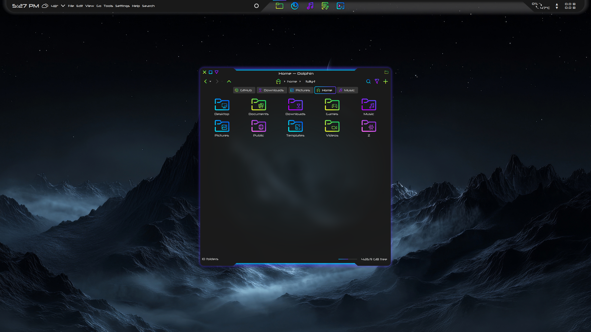

# Xenon Window Decorations

Xenon is a window decoration for KDE and a GTK theme with a blue-purple glow, designed to complement the [Xeno](https://github.com/tully-t/Xeno/tree/main) theme suite for KDE.

## In this repository, you'll find:

- Xenon Aurorae window decoration theme
- Xenon-gtk GTK theme

Icons: [Sours](https://github.com/tully-t/Sours)

Color Scheme: [Xeno](https://github.com/tully-t/Xeno/tree/main/color-schemes)

Kvantum theme: [Xeno](https://github.com/tully-t/Xeno/tree/main/Kvantum)

Plasma theme: [Xeno](https://github.com/tully-t/Xeno/tree/main/Plasma)

Conky (panel background): [Xeno](https://github.com/tully-t/Xeno/tree/main/Conky)

Font: [Neuropolitical](https://www.dafont.com/neuropolitical.font)

## Installation

Each component folder contains a README with installation instructions, recommendations, and customization notes specific to that component.

## Preview

### Contributing

Please open an issue if you notice any bugs, errors, or unexpected behavior.

### License

This project is licensed under the GNU GPL v3 - see the [LICENSE.md](LICENSE.md) file for details.
